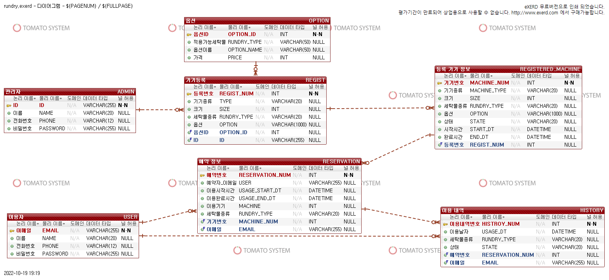

# 무인 세탁소 예약 서비스
1. 프로젝트 소개
    + 무인 세탁소의 세탁기를 세탁기의 종류, 세탁물의 종류, 세탁 방법 등등을 사용자에게 입력 받아 
   이를 사용 시간을 예약하고 사용할 수 있는 서비스 입니다.
2. 프로젝트 기능
    + 관리자 기능
      + 최초 관리자는 DB에 항상 저장 
      + 관리자 등록
      + 세탁기 및 건조기 등록, 상태 관리, 제거
      + 세탁 옵션에 따른 가격 설정
    + 세탁소 이용자 기능
      + 이용자 회원 가입 및 탈퇴
      + 세탁기 및 건조기 이용 시간 설정 및 세탁 옵션 설정
      + 세탁기 및 건조기 세탁물 회수
      + 세탁기 및 건조 완료 알림 메시지 전송
3. 기술 스택
    + JAVA
    + Spring Boot
    + Mysql 또는 Graphql(사용 해보고 싶음)
4. Dcouments
     